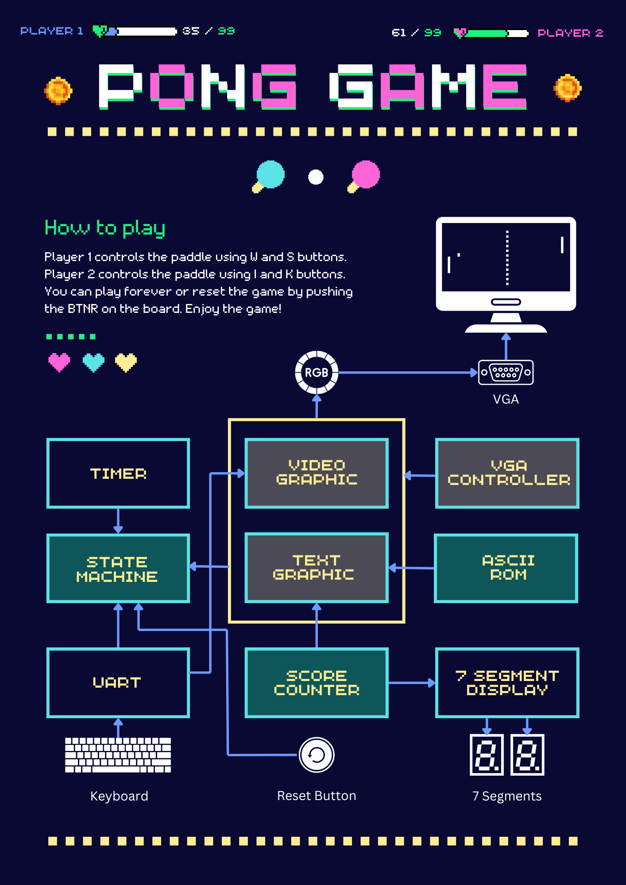

# 🏓 Pong game on STM32

Developed as part of the **Hardware Synthesis Laboratory I (2110363)** course at **Chulalongkorn University (Semester 1, 2023)**.

this code is based on: (basys3 1 player pong game) https://youtu.be/tELTeQb-Dc4?si=Sqm0u97xXiqhJjGk
